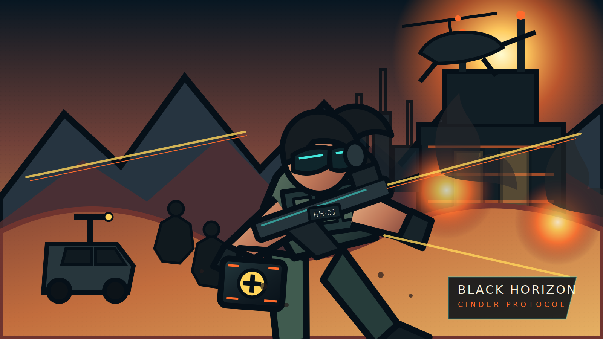

# Commando PC: Operation Cinder

A complete original web arcade shooter inspired by the urgency and readability of classic top-down run-and-gun games, rebuilt with a modern comic-book presentation. The game uses no copied franchise assets and no runtime dependencies: rendering is custom HTML5 Canvas, while the score and sound effects are synthesized live with WebAudio.



## Play locally

```bash
npm run dev
```

Open `http://localhost:4173`.

## Campaign

American Special Forces operator Captain Mara Vance, callsign Ranger One, enters Iran's central desert to recover a stolen plutonium core from the fictional Cinder Directorate. The story is presented through a five-panel original comic intro and six distinct missions:

1. **Dust Knife** — canyon border cordon
2. **Green Mirage** — oasis and qanat settlement
3. **Broken Crown** — mountain fortress ruins
4. **White Horizon** — salt-flat convoy pursuit
5. **Black Glass** — night refinery sabotage
6. **Cinder Vault** — isotope facility and boss encounter

The narrative and factions are fictional. No real operation, unit deployment, person, flag, or faction insignia is depicted.

## Features

- Six complete campaign levels with individual palettes, weather, props, objectives and music patterns
- Seven enemy archetypes: rifleman, rusher, grenadier, marksman, shield unit, heavy unit, drone, plus a multi-phase boss
- Six weapons: carbine, SMG, shotgun, LMG, grenade launcher and arc prototype
- Dash invulnerability, grenades, armor, pickups, reloads, weapon cycling and combo scoring
- Destructible relays, coolant pumps, convoy and recoverable plutonium core
- Original key art, logo, comic panels, HUD, menu, pause, briefing, victory, defeat and campaign-complete screens
- Procedural muzzle flashes, shell ejection, impact sparks, smoke, dust, explosions, screen shake, decals and enemy-specific death treatments
- Original synthesized soundtrack with mission-specific patterns and procedural SFX
- Keyboard, mouse and touch controls
- Local progress/high-score saving, offline service-worker cache and GitHub Pages deployment workflow

## Controls

| Action | Input |
| --- | --- |
| Move | WASD or arrow keys |
| Aim | Mouse |
| Fire | Mouse button or J |
| Reload | R |
| Throw grenade | Space |
| Dash | Shift |
| Cycle weapon | Q or Tab |
| Pause | P or Escape |
| Toggle audio | M |

Touch devices receive an analog movement stick, fire, dash and grenade controls. Touch movement automatically aims at the nearest active threat.

## Validation

```bash
npm run check
```

This performs JavaScript syntax checks and verifies that the shell, campaign data, assets, audio engine, weapon roster and enemy roster are present.

## Asset policy

All visual assets in `assets/`, all Canvas-rendered art, the story, music patterns, audio synthesis, UI, VFX and source code were created specifically for this repository. There are no stock packs, copied sprites, sample tracks or placeholder assets.
